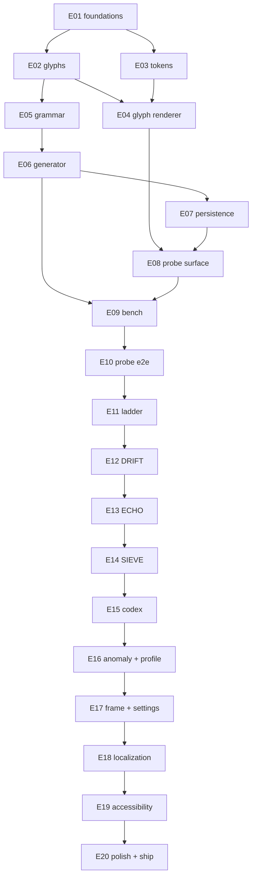

# HUNCH — delivery board

20 epics · 190 planned tasks · **one branch, one PR, one merge per epic.** Nothing is worked out of order and nothing is merged red.

Repo `/Users/zakariafatahi/50-apps-challenge/E03` · remote `git@github.com:zakariaf/HUNCH.git` · `gh` 2.96.0 authenticated as `zakariaf` over SSH.

---

## Start here — the bootstrap

> **`main` has ZERO commits and there is no CI workflow yet.** A pull request cannot be opened against an empty default branch.
>
> **The very first action in this project is `E01/T01`, and it commits directly to `main`.** It lands `README.md`, `.gitignore`, `LICENSE` and the root `.swift-format`, then pushes. Nothing can be branched and nothing can be PR'd until that commit is on `origin/main`.
>
> ```bash
> cd /Users/zakariafatahi/50-apps-challenge/E03
> # follow epics/E01-foundations/T01-bootstrap-main.md, then:
> git add README.md .gitignore LICENSE .swift-format
> git commit -m "E01/T01: bootstrap main"
> git push -u origin main
> ```
>
> Only then: `git checkout -b epic/E01-foundations` and work T02…T09 the normal way. The GitHub Actions workflow is itself created inside E01 (T07), so once it is on E01's branch and triggering on `pull_request`, **E01's own PR gets checks** and the loop below is self-hosting from that point onward.
>
> This is the one step that breaks the entire loop if it is skipped.

---

## How to work this board

Pick the next epic whose dependencies are all merged. Then, exactly:

```bash
git checkout main && git pull                  # 1. start from merged main, always
git checkout -b epic/E05-grammar               # 2. the branch named in that epic.md

# 3. work the epic's tasks IN ORDER. For each task file:
#      read its "Skills to load" table and load them
#      write the failing test first (the task's TDD section)
#      implement until it passes
#      /simplify      — reuse, simplification, efficiency; re-run the tests after
#      /code-review   — correctness on the working diff; fix what it finds
#    git commit -m "E05/T03: the mask-driven evaluator and §3.5's sequencing contract"

git push -u origin epic/E05-grammar            # 4.
gh pr create                                   # 5. body from .github/pr-body.md: the gate, its output, the DECISIONS.md entries
gh pr checks --watch                           # 6. WAIT. do not merge on pending or failing
gh pr merge --squash --delete-branch           # 7. only when every check is green
git checkout main && git pull                  # 8. then, and only then, the next epic
```

Three rules that are not negotiable:

- **The next epic does not start until the current PR is merged.** No stacked branches, no parallel epics, no "I'll start E06 while E05 is in review".
- **A red check is fixed on the branch and pushed again — never merged over.** No `--admin`, no merge queue bypass.
- **A check is never disabled or weakened to reach green.** No `continue-on-error`, no skipped test, no relaxed tolerance, no deleted `tests.json` entry. A gate that can be waived is documentation, not a gate. If a gate is genuinely wrong, that is a `DECISIONS.md` entry and a separate change — argued, not quietly dropped.

---

## The epics

Gates below are the sharp clause; the full gate is the `gate` row of each `epic.md`.

| Id | Title | Branch | Depends on | Tasks | Gate | Status |
|---|---|---|---|---|---|---|
| E01 | Foundations, bootstrap and CI | `epic/E01-foundations` | — | 9 | Fast suite green < 10 s · hygiene script fails a planted `URLSession` · the workflow is green on E01's own PR · `SWIFT_VERSION = 6.0` from xcconfig, zero settings in `project.pbxproj` | |
| E02 | Glyph vocabulary and the bitboard algebra | `epic/E02-glyphs` | E01 | 6 | `Deck.all` is 256 with `glyphID` round-tripping · lift/tile and `P == lift(P & FULL256)` hold · every mask matches brute force · `MaskTable.resident` ≈ 54 KB | |
| E03 | Design tokens and RenderEnv | `epic/E03-tokens` | E01 | 6 | Every §13.2 ratio recomputed from hex to 2 dp in three themes · HC floor ≥ 9.7 : 1, primary exactly 21.00 : 1 · resolution order proves `3.0 → 3.75 → 4.25` · hex grep exits 1 outside `Tokens/` | |
| E04 | Glyph renderer and the shared marks | `epic/E04-glyph-renderer` | E02 · E03 | 9 | 256 pairwise-distinct greyscale rasters at 44 pt @2× with `T` measured and recorded in `DECISIONS.md` · a palette substitution moves no geometry · the DEBUG gallery renders every component × state × three themes | |
| E05 | Grammar, evaluator and equivalence | `epic/E05-grammar` | E02 | 8 | Evaluator agrees with brute force over all 65,536 ordered pairs · RNF idempotent, one law one layout · the eight `\|H\|` counts match §5.2 exactly (27,015) · `lowerBandIndex.bin` round-trips inside the 3 s A15 budget | |
| E06 | Difficulty, the Bench model and the generator | `epic/E06-generator` | E05 | 10 | 10,000-law × 8-band suite in ≈ 1.2 s · determinism byte-identical against the cross-process golden · G10 node-identical for all 80,000 laws · the 200 k Bench fuzzer parses-or-bars every configuration | |
| E07 | Persistence and the round core | `epic/E07-persistence` | E06 | 9 | save → kill → relaunch identity for every `StoreFile` · `Fixtures/v1/` green · all five resets leave `anomaly.json` **and** `anomaly.hw` byte-identical · a truncated shelf quarantines · `RoundPhase` switch has no `default:` | |
| E08 | The PROBE play surface | `epic/E08-probe-surface` | E04 · E07 | 10 | A probe composed and fed in the simulator on both devices · the 420 / 320 ms lock and single-slot queue assert · `tickPitch` and `sheetCells ≥ 1 + max cap` assert · SE and Pro Max match §6.2 region for region | |
| E09 | The Bench, the Assay, the Seal and resolution | `epic/E09-bench` | E06 · E08 | 12 | A full round plays to a correct declaration · the `SealBar` switch is exhaustive · counterexample reproduces §4.5 on a seeded corpus · reveal absolutes 2,480 / 1,660 / 2,040 ms under a phase-count assertion | |
| E10 | PROBE end to end: shell, resume and onboarding | `epic/E10-probe-e2e` | E09 | 10 | Played, quit, relaunched, **resumed at the exact probe with the draft intact** · the 13 beats run and `OnboardingLedger` records success · the elastic cap defers while `sawReject == false`, hard-stops at 24 · subagent diff review vs `SPEC.md` clean | |
| E11 | The adaptive engine and the harnesses | `epic/E11-ladder` | E10 | 12 | H1–H21 at the fast subset · H3 = 0.80 ± 0.03 · H10 ρ ≥ 0.75 overall, ≥ 0.45 within band · H18 `π₀ = 0.44` · H19 < 2 %/band · Level-B matrix green under `HUNCH_CALIBRATION=1` · Level A's 10⁶ rounds < 0.4 s | |
| E12 | DRIFT | `epic/E12-drift` | E11 | 9 | D1–D7 over a seeded pair corpus · §7.7 reproduces (600, 2 marks, fractured, `R = 16`, 0.303) · resume neither re-fires nor un-fires the hinge · the tick row compresses to 7.2 pt at `par_DRIFT = 40` | |
| E13 | ECHO | `epic/E13-echo` | E12 | 9 | Exactly one lit pool member at `primer → casting` · §8.7 reproduces (setF1 0.75, order 0.667, 506, 1 mark, 0.50) · one interruption restarts the cast free, a second abandons with **no** ability update | |
| E14 | SIEVE | `epic/E14-sieve` | E13 | 10 | `P = 132 pt > 88 pt` at every `r` across bands 1–6 × tempo 0–3 · S1–S5 · §9.6 reproduces (0.831 / 831 / 2 marks) · Reduce-Motion parity on `preview(n) + window(n)` and the station at time `t` | |
| E15 | The Codex | `epic/E15-codex` | E14 | 9 | Opening a shelf parses **exactly one** file and none exceeds 512 KB · a duplicate **never** mints a second page · shelf counts and fill arcs agree with `codex-index.json` · thumbnails collision-free | |
| E16 | The Anomaly, the Profile and Statistics | `epic/E16-anomaly-profile` | E15 | 11 | Two devices, same UTC date → identical law from `utcDayIndex` through `generate` · no reset touches `anomaly.json`/`.hw` · `.clockBehind` locks and unlocks at `highWaterDay + 1` · axes monotone · a uniform rise leaves the contour pixel-identical | |
| E17 | The Frame, navigation and Settings | `epic/E17-frame-settings` | E16 | 9 | `NavigationDepthTests` asserts `≤ 2` for all 18 screens · each reset alert acts on exactly its DATA row's file set · mode keys bar/unbar strictly on §9.10's archive evidence · the Frame withheld until round 1 ends | |
| E18 | Localization | `epic/E18-localization` | E17 | 9 | 12 languages complete, zero `new`/`needsReview`, ≤ 250 keys · banned lexemes clean per locale · `PlaySurfaceTextTests` fails on any `Text` outside `.accessibility*` in the six play files · `ar` flips direction **with no relaunch** | |
| E19 | Accessibility | `epic/E19-accessibility` | E18 | 11 | §13.12's 13 gates green with a `tests.json` entry each · `performAccessibilityAudit` clean on every §12.2 screen · `LawNarrator` parity over 10,000 laws · AX5 × 5 locales, zero truncation, every target ≥ 44 × 44 pt | |
| E20 | Polish and ship | `epic/E20-polish-ship` | E19 | 12 | Archive with **zero warnings** under `-warnings-as-errors` · binary < 15 MB · airplane-mode playthrough on device · shader ≤ 0.4 ms/frame on A15 · three testers discriminate admit/reject/bar face-down · nightly Level-B matrix green | |

**Board state.** 183 of the 190 task files are on disk. `E20-polish-ship` has T01–T05 written; T06–T12 are specified in its `epic.md` table but not yet expanded into task files. Every epic and task currently reads `status: not started`.

---

## Dependency graph



E01 unblocks two branches at once (E02 and E03), which rejoin at E04. E06 unblocks both E07 and E09. From **E11 onward the chain is strictly linear** — every epic depends on exactly its predecessor.

---

## The critical path to the MPP

`GAME_DESIGN.md` §14.2 defines the Minimum Playable Product as **PROBE, complete, across all eight bands, plus the Codex** — the glyph vocabulary and renderer, the full grammar/generator/guardrails/difficulty function, the Dial, ribbon, twin, Bench with all four tile classes, the Assay and the Seal, counterexample and two strikes, par/cap/marks/scoring, the adaptive engine with cold-start calibration, onboarding-by-doing, the Codex with eight shelves and page detail, mid-round persistence, the law-reveal with admit/reject audio and haptics, the dark theme, full VoiceOver, Dynamic Type and RTL, and twelve languages.

**Shortest chain:** `E01 → E02 → E03 → E04 → E05 → E06 → E07 → E08 → E09 → E10 → E11 → E15 → E17 → E18 → E19 → E20 (T01–T05, T09, T10)`.

That chain skips E12–E14 and E16, whose work §14.2 explicitly cuts. Two `depends on` rows would have to be re-pointed to walk it — **E15 currently declares E14 and E17 declares E16** — and re-pointing them is a deliberate scope decision that belongs in `DECISIONS.md`, not an edit made in passing. The board as written simply runs E12 → E13 → E14 → E15 → E16 → E17 in order; keep that unless the MPP is being cut as a shipping milestone.

> **Read `depends on` as two different claims.** Most rows are a **technical** prerequisite: E08 cannot start before E04 because it draws glyphs. But E15 → E14 and E17 → E16 are **sequential** — position in the build order, not a code dependency. The Codex is fed by declarations from PROBE (E10) over the store from E07; SIEVE contributes at most a page at `ratio ≥ 0.92`, which is a branch that simply never fires if SIEVE does not exist. Likewise the Frame renders whatever modes are unlocked, and E16's Anomaly and Profile are two of its keys, not its skeleton.
>
> That is what makes the MPP genuinely reachable rather than nominally so: walking it requires **no code to be stubbed**, only two rows re-pointed at their real technical predecessors — E15 → E10, E17 → E15. Before doing that, confirm it against the two epics' own scope tables; and if you take the decision, record it, because a `depends on` edited in passing is how a build order silently stops meaning anything.

**What you have on arrival.** A genuinely finished game: 27,015 laws over eight bands, an archive that only grows, a difficulty engine holding an 80 % success rate, resume-anywhere persistence, and twelve fully localized, fully accessible languages. Twenty hours of play, not a demo.

**Deliberately absent, per §14.2.** DRIFT, ECHO and SIEVE (all three are gated behind Codex pages, so their absence is invisible on day one); the daily Anomaly; the Profile and Statistics screens. Inside the MPP epics themselves, the same cut removes the spool sheet (E08/T09), the Codex facet bar and slot maps (E15/T07–T08), the 90-day ghost (E16/T10), the grain shader (E20/T07), the light theme, left-hand keys and the anti-boredom ceiling variation (E11/T07). Each is added whole or not at all — none is cheap to fake later.

---

## Skills quick reference

Thirteen skills in `.claude/skills/`. Every task file names the ones it needs in its **Skills to load** table; load them *before* writing anything.

| Skill | Owns | Load it when |
|---|---|---|
| `hunch-swift-code` | The `HunchCore` boundary predicate, target routing, the naming pass, type choice, state ownership, the composition root | Before creating any Swift file or typing a declaration. **First** for engineering work |
| `hunch-swift-concurrency` | Default isolation per target, the `MainActor` roster, the exactly two justified actors, the RNG scoping rule, the one `@unchecked Sendable` hatch | Any `async`/`actor`/`Sendable`/`nonisolated`/`Task` decision, or a concurrency diagnostic |
| `hunch-swift-testing` | The seven brief invariants and their homes, the T21 deviation, cross-process determinism, the eight tags, the 10 s fast-suite budget | Writing or repairing any test; deciding what is nightly-only |
| `hunch-build-and-ci` | `Config/*.xcconfig`, both `Package.swift`, `check-source-hygiene.sh`, the one run-script phase, the three `.xctestplan` files, the workflow | Touching build settings, manifests, hygiene greps, test plans or CI |
| `hunch-design-tokens` | L0/L1/L2 layering, `RenderEnv`, the resolution order, register segregation, the three themes | Before writing any hex, `lineWidth`, opacity, font size, radius or duration. **First** for any drawing task |
| `hunch-glyph-renderer` | Glyph geometry, the four registers, the two size regimes, the four-pass draw order, the distinctness constant `T` | Anything touching a glyph, the deck, `GlyphShape` or `GlyphCanvas` |
| `hunch-shared-marks` | The seven reused marks — verdict ring, ghost frame, machined bar, link arc and return elbow, cancel hatch, tick row, arc meter — one owning function each | A verdict animates, a socket ghosts, a Seal bars, a tick row or progress arc renders |
| `hunch-bench-instruments` | Rows B of `DESIGN-SYSTEM-SCOPE.md` §3 — fourteen composed play surfaces, their geometry, states, select modes | A ramp, socket, rule-tile, wedge, Fork, Tally, coupler, Assay, Seal, throat, ribbon, commit bar or SIEVE gate |
| `hunch-chrome-and-meta` | Rows C and D — key, instrument bar, rule, scrim, numeral readout, stock controls, shelf plate, thumbnail, Profile contour, Codex page — plus their `C.*` namespaces | Settings, Statistics, About, the Codex, the Frame, the Profile, any framing around play |
| `hunch-motion-and-feedback` | Beat sheets, cue and haptic firing points, the Reduce Motion substitution table, the `Feedback` target's shape | Animating anything; when a cue or haptic fires; Reduce Motion / Low Power / strike behaviour |
| `hunch-sigil-drawing` | The sigil construction grammar, the 22 authored marks, the distinctness harness | A sigil is undrawn, ambiguous, or being invented for the first time |
| `hunch-accessibility` | The element index, four rotors, Magic Tap, escape, announcement order and wording, narration parity, the CI audit | Adding accessibility modifiers, labelling a textless drawn mark, auditing a screen |
| `hunch-release` | The gate order before an archive, version and build numbers, archive/export/upload, the App Store rejection surface | **User-invoked only** (`disable-model-invocation: true`). E20/T12 hands over to it — do not improvise the steps |

---

## Conventions

**Task file anatomy.** Every task file opens with a header table (`Epic`, `Priority` P0/P1/P2, `Size` S/M/L, `Depends on`, `Delivers` — its `§14.1` row, `Status`), then in order: **Skills to load** · **Objective** · **Specification** (a source table citing `GAME_DESIGN.md` sections and `ios-swift-guide` rule ids) · **TDD — the test comes first** · **Files** · **Implementation notes** · **Acceptance criteria** · **Close the task** · **Out of scope**. Work them top to bottom. *Out of scope* is binding — it names work that belongs to a later task, not work to sneak in.

**Status.** `not started` is the only value on disk today (20 epics + 183 tasks). Move a task to `in progress` when you branch, `done` when its commit lands; move the epic to `done` when its PR is squash-merged.

**Branches.** One per epic, exactly the string in that `epic.md`'s `branch` row: `epic/<EID>-<slug>` (e.g. `epic/E09-bench`). E01's branch is cut *after* T01's direct commit to `main`. Squash-merge, delete the branch.

**Commits.** `<EID>/<TID>: <what changed>` — one commit per task, e.g. `E05/T03: the mask-driven evaluator and §3.5's sequencing contract`.

**Where the specs live.**

| Path | What it is |
|---|---|
| `GAME_DESIGN.md` | **The spec.** Every task cites it by section. When code and the GDD disagree, the GDD wins until `DECISIONS.md` says otherwise |
| `ios-swift-guide/` | Seven files of numbered engineering rules — `P1–P46`, `N1–N47`, `W1–W57`, `A1–A50`, `R1–R56`, `T1–T63`, `B1–B46` (365 rules) — cited by id, plus `08-APPLIED-TO-HUNCH.md` which fixes this repo's tree |
| `design/` | `DESIGN-SYSTEM-SCOPE.md` (what §13 is and is not), and the chosen visual direction **`DIRECTION-A-PHOSPHOR.md`** with its `mockup-phosphor.html`. `DIRECTION-B-PLATE.md` is the rejected alternative, kept for the argument |
| `.claude/skills/` | The 13 skills above — the operational how, where `GAME_DESIGN.md` is the what |
| `epics/E**/epic.md` | Goal, why now, scope, the task list, the gate and the definition of done for one PR |
